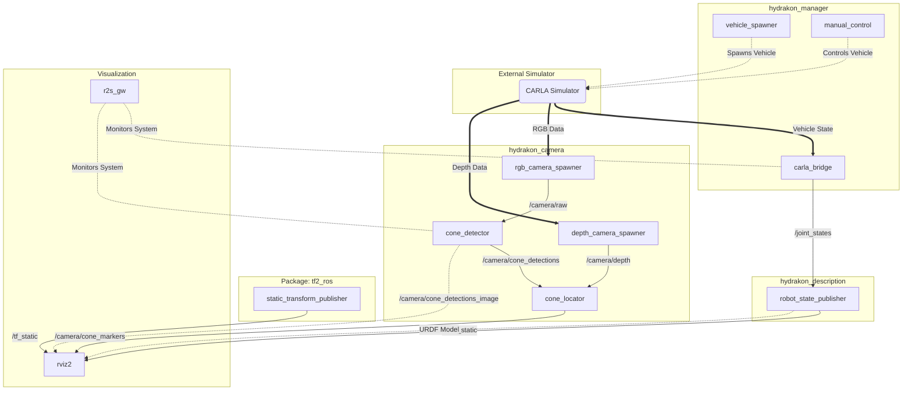

This diagram illustrates the architecture of the Hydrakon simulation system, showing the data flow between different ROS 2 nodes and packages.

## Description of Data Flow

1.  **Vehicle Control & State:**
    *   The `vehicle_spawner` initializes the car in CARLA.
    *   The `manual_control` node sends control commands to CARLA.
    *   The `carla_bridge` reads the car's state (velocity, steering) from CARLA and calculates wheel positions, publishing them to `/joint_states`.

2.  **Robot Visualization:**
    *   `robot_state_publisher` reads the URDF and the `/joint_states` to publish the Transform Tree (`/tf`).
    *   `rviz2` uses this TF tree to render the moving robot model.

3.  **Perception Pipeline:**
    *   `rgb_camera_spawner` and `depth_camera_spawner` bridge CARLA sensor data to ROS topics.
    *   `cone_detector` runs YOLO inference on the RGB image to find bounding boxes.
    *   `cone_locator` combines these bounding boxes with the depth map to calculate the 3D position of cones relative to the car.
    *   These 3D positions are published as markers for Rviz.